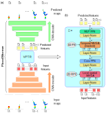
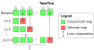
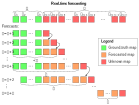

# FloodSformer
This is the official PyTorch implementation of the FloodSformer (FS) model.



**Figure:** *Architecture of FloodSformer model. (a) General workflow of the proposed model. (b) Sketch of one of the B VidHRFormer blocks forming the VPTR module.*

## Installation
First, create a conda virtual environment and activate it:
```
conda create -n floodsformer python=3.10
source activate floodsformer
```

Then, install the following packages:

- pytorch: `conda install pytorch torchvision torchaudio pytorch-cuda=11.7 -c pytorch -c nvidia`
- fvcore: `pip install -U fvcore`
- simplejson: `pip install simplejson`
- matplotlib: `pip install matplotlib`
- einops: `pip install einops`
- psutil: `pip install psutil`
- timm: `pip install timm`
- OpenCV: `pip install opencv-python`
- tensorboard: `pip install tensorboard`
- TorchMetrics: `pip install torchmetrics`

## Dataset preparation
Please use the dataset preparation instructions provided in [DATASET.md](docs/DATASET.md)

## Checkpoints
The pretrained and final checkpoints are provided in [CHECKPOINT.md](docs/CHECKPOINT.md)

## Parameter definition
The files with the model parameters are stored in [Parflood](configs/Parflood) folder. The path to the selected file must be passed as an argument "--cfg" when running the script.

| Case study (dam-break) | Train/test | Launch script |
| ---------- | ---------- | ----- |
| 1. Parabolic channel | AE train | `python3 run_net.py --cfg configs/Parflood/DB_parabolic_trainAE.yaml` |
|   | VPTR train | `python3 run_net.py --cfg configs/Parflood/DB_parabolic_trainVPTR.yaml` |
|   | Real-time forecasting | `python3 run_test.py --cfg configs/Parflood/DB_parabolic_testFS.yaml` |
| 2. Rectangular tank | AE train | `python3 run_net.py --cfg configs/Parflood/DB_reservoir_trainAE.yaml` |
|   | VPTR train | `python3 run_net.py --cfg configs/Parflood/DB_reservoir_trainVPTR.yaml` |
|   | Real-time forecasting | `python3 run_test.py --cfg configs/Parflood/DB_reservoir_testFS.yaml` |
| 3a. Parma River dam | AE train | `python3 run_net.py --cfg configs/Parflood/DB_Parma_20m_trainAE.yaml` | 
|   | VPTR train | `python3 run_net.py --cfg configs/Parflood/DB_Parma_20m_trainVPTR.yaml` |
|   | Real-time forecasting | `python3 run_test.py --cfg configs/Parflood/DB_Parma_20m_testFS.yaml` |

More information about parameters in the [defaults.py](floodsformer/config/defaults.py) file.

## Training
Run the file [run_net.py](run_net.py) to train the FloodSformer model. A script with an example for launching slurm jobs using one GPU is provided in [slurm_launch_train.sh](slurm_scripts/slurm_launch_train.sh).

Please see the **PAPER** for a detailed description of the hyperparameters used and the training steps required.

IMPORTANT: the AE training is complex, expecially during the initial step when the GAN loss is taken into account. Consequently, we recommend utilizing the pre-trained AE weights that are available in [CHECKPOINT.md](docs/CHECKPOINT.md). To apply the FS model for different case studies, we recommended to start the training using the weights that have been trained for one of the cases presented here (e.g., dam-break of the Parma River control dam).



**Figure:** *Sketch of the prediction method for train and test on a sequence of I+1 frames. The forecast of the next frame (red square) is achieved considering as inputs all the ground-truth maps of the precedent instants (green squares).*

## Real-time forecasting
Run the file [run_test.py](run_test.py) to test the real-time forecasting. A script with an example for launching slurm jobs using one GPU is provided in [slurm_launch_test.sh](slurm_scripts/slurm_launch_test.sh).

Run our interactive real-time forecasting demo using [Colab notebook]().



**Figure:** *Procedure for the autoregressive real-time forecasting of F future maps. Each forecasted future frame (orange square) is used to make the prediction of the next future maps (red squares). In this illustration we assumed P<I<F and, for simplicity, we represented only the input and the output maps of the prediction, neglecting the latent feature computations.*

## License
This project is under the [CC BY-NC 4.0](https://creativecommons.org/licenses/by-nc/4.0/) license. See [LICENSE](LICENSE) for details.

## References
This code takes inspiration from the following works:
- TimeSformer: https://github.com/facebookresearch/TimeSformer 
- VPTR: https://github.com/XiYe20/VPTR
