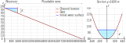
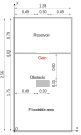

# Dataset Preparation
Details about the different case studies considered in the present work can be found in the **PAPER**.

Water depth maps must be saved in one of the following formats:
- [`Surfer 6 Binary Grid`](https://surferhelp.goldensoftware.com/topics/surfer_6_grid_file_format.htm?Highlight=Surfer%206%20Grid%20File%20Format) (recommended)
- [`Esri ASCII raster`](https://desktop.arcgis.com/en/arcmap/latest/manage-data/raster-and-images/esri-ascii-raster-format.htm)

Extensions of the water depth maps:
- .INH: initial water depth map (not mandatory)
- .DEP: water depth maps at different instants

Please verify that the parameters `DATA.PATH_TRAIN_DATASET` and `DATA.PATH_TEST_DATASET` contain the correct paths to the train and test folders, respectively (see files in [Parflood](configs/Parflood) folder).


## 1. Dam-break in a channel with a parabolic cross section
Synthetic dam-break in a non-horizontal channel with a parabolic cross section. 



The terrain profile can be described by means of the following equation:

z = 96 + 0.0001x<sup>2</sup> - 0.01y  x ∈ [-640, 640], y ∈ [0, 9600]

More information (e.g., geometry, initial conditions, resolution, Manning roughness coefficient, etc.) can be found in the **PAPER**.

#### Dataset folder structure
```
dataset
 └──DB_parabolic
     │──Results      (train/val samples)
     │   │──output_<number/name>  (first output folder)
     │   │      <name>.INH        (initial condition map - water depth - not mandatory)
     │   │      <name>0001.DEP    (water depth map - frame 1)
     │   │      <name>0002.DEP    (water depth map - frame 2)
     │   │      ...
     │   │──output_<number/name>  (second output folder)
     │   │      <name>.INH        (initial condition map - water depth - not mandatory)
     │   │      <name>0001.DEP    (water depth map - frame 1)
     │   │      <name>0002.DEP    (water depth map - frame 2)
     │   │      ...
     │   └──...
     └──Results_test    (test samples)
         └──output_<number/name>  (output folder for the test)
                <name>.INH        (initial condition map - water depth - not mandatory)
                <name>0001.DEP    (water depth map - frame 1)
                <name>0002.DEP    (water depth map - frame 2)
                ...
```


## 2. Dam-break in a rectangular tank
Synthetic dam-break flow against an obstacle at the laboratory scale.



More information (e.g., geometry, initial conditions, resolution, Manning roughness coefficient, etc.) can be found in the **PAPER**.

#### Dataset folder structure
```
dataset   
 └──DB_reservoir
     │──Results      (train/val samples)
     │   │──output_<number/name>  (first output folder)
     │   │      <name>.INH        (initial condition map - water depth - not mandatory)
     │   │      <name>0001.DEP    (water depth map - frame 1)
     │   │      <name>0002.DEP    (water depth map - frame 2)
     │   │      ...
     │   │──output_<number/name>  (second output folder)
     │   │      <name>.INH        (initial condition map - water depth - not mandatory)
     │   │      <name>0001.DEP    (water depth map - frame 1)
     │   │      <name>0002.DEP    (water depth map - frame 2)
     │   │      ...
     │   └──...
     └──Results_test    (test samples)
         └──output_<number/name>  (output folder for the test)
                <name>.INH        (initial condition map - water depth - not mandatory)
                <name>0001.DEP    (water depth map - frame 1)
                <name>0002.DEP    (water depth map - frame 2)
                ...
```


## 3. Dam-break of the Parma River flood detention reservoir
Hypothetical collapse of the Parma River flood control reservoir dam.


Coordinate system: EPSG:23032 - ED50 / UTM zone 32N. \
More information (e.g., geometry, initial conditions, resolution, Manning roughness coefficient, etc.) can be found in the **PAPER**.

#### Dataset folder structure
```
dataset   
 └──DB_Parma
     │──Results_20m      (train/val samples)
     │   │──output_<number/name>  (first output folder)
     │   │      <name>.INH        (initial condition map - water depth - not mandatory)
     │   │      <name>0001.DEP    (water depth map - frame 1)
     │   │      <name>0002.DEP    (water depth map - frame 2)
     │   │      ...
     │   │──output_<number/name>  (second output folder)
     │   │      <name>.INH        (initial condition map - water depth - not mandatory)
     │   │      <name>0001.DEP    (water depth map - frame 1)
     │   │      <name>0002.DEP    (water depth map - frame 2)
     │   │      ...
     │   └──...
     └──Results_test_20m    (test samples)
         └──output_<number/name>  (output folder for the test)
                <name>.INH        (initial condition map - water depth - not mandatory)
                <name>0001.DEP    (water depth map - frame 1)
                <name>0002.DEP    (water depth map - frame 2)
                ...
```
